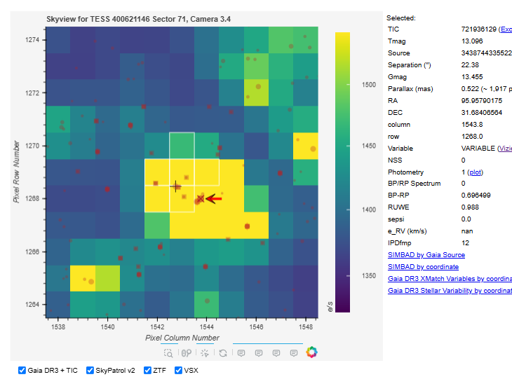
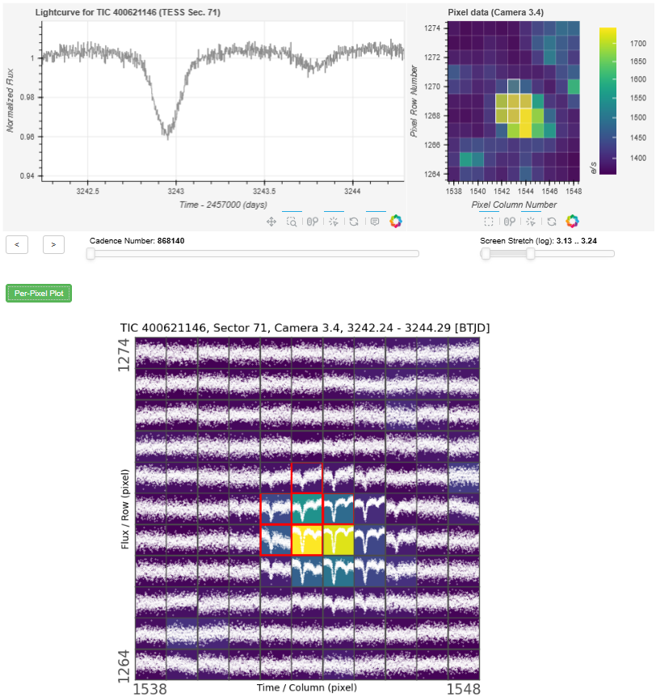
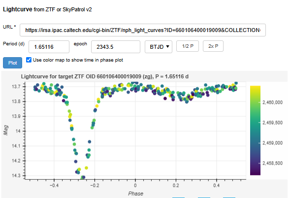

# TESS Target Pixels Inspector

A web application to help users to identify the source of variable signals by allowing them to:

- inspect data at pixel level from TESS TargetPixelFiles or TESSCut
- view TESS pixels overlaying with data from TIC, Gaia DR3, ZTF Archive, ASAS-SN SkyPatrol v2, and VSX.








## Installation

In your Python virtual environment, install the dependency ([`lightkurve`](https://github.com/lightkurve/lightkurve/) and [`skypatrol`](https://github.com/asas-sn/skypatrol)):

```shell
pip install -r src/tpf/gcloud/requirements.txt
```

Start the webapp:
```shell
bokeh serve --show src/tpf/
```

You are done! The app will be available at http://localhost:5006/tpf .


Notes:

- To change the port of the webapp, add `--port=<port_number>` to `bokeh` line.

## Deploying to cloud environments

- Google Cloud Run: run [`src/tpf/gcloud/assemble.sh`](src/tpf/gcloud/assemble.sh), and follow the instructions.


---

## Development

The webapp codes are at [`src/tpf`](src/tpf).

The main features are built on top of [`lightkurve`](https://github.com/lightkurve/lightkurve/).
Its interact features are patched to add more functionalities, and to work in an webapp.
The patched codes are at [`src/tpf/lk_patch`](src/tpf/lk_patch).

A [notebook](Playground.ipynb) can be used to make testing out changes more easily:
one can test out changes to individual components, with reload support.
